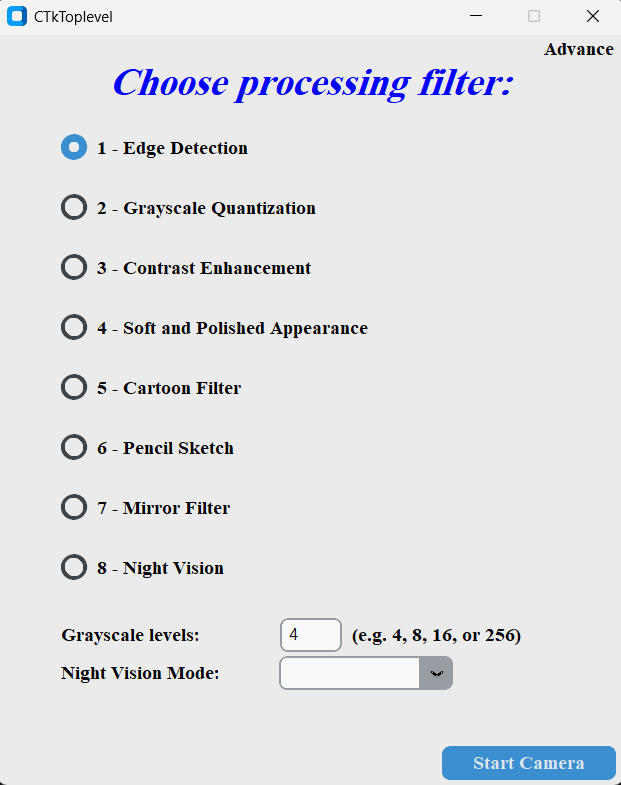
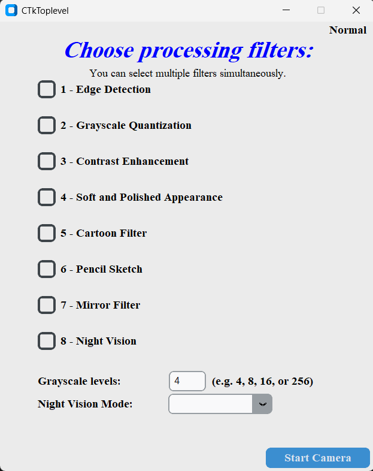

# 🎥 Video Processing GUI

##👨‍💻 Author
Muath Hassoun
Computer Engineer and Software Developer
GitHub: 

> Real-time camera filters using Python, OpenCV, and CustomTkinter.





---

## 🚀 About the Project

This project is a smart and interactive video processing application that allows users to apply multiple filters to their live webcam stream. The user can choose between two modes:

- **Normal Processing**: Apply a single selected filter.
- **Advance Processing**: Apply multiple filters simultaneously in real time.

---

## 🖼️ Filters

| Filter Name               | Description                                         |
|--------------------------|-----------------------------------------------------|
| Edge Detection           | Highlights the edges in the image using Canny       |
| Grayscale Quantization   | Converts video to a quantized grayscale             |
| Contrast Enhancement     | Enhances image contrast using histogram equalization |
| Soft Appearance          | Applies a bilateral filter for a smooth appearance |
| Cartoon Filter           | Adds a cartoon-like effect                          |
| Pencil Sketch            | Converts the image into a pencil sketch            |
| Mirror Filter            | Flips the image horizontally (mirror effect)       |
| Night Vision             | Simulates night vision in Red, Green, or Blue modes |

---

## 🖥️ GUI Modes

### 🟦 Normal Mode
- Choose one filter from a list.
- Start the camera and preview the filtered output in real-time.

### 🟩 Advance Mode
- Select multiple filters (can be applied in sequence).
- Customize parameters like:
  - Grayscale levels (`4`, `8`, `16`, `256`)
  - Night vision color (`Red`, `Green`, `Blue`)

---

## 📦 Requirements

- Python 3.8+
- OpenCV (`cv2`)
- CustomTkinter
- Numpy

You can install dependencies using:

```bash
pip install opencv-python customtkinter numpy
